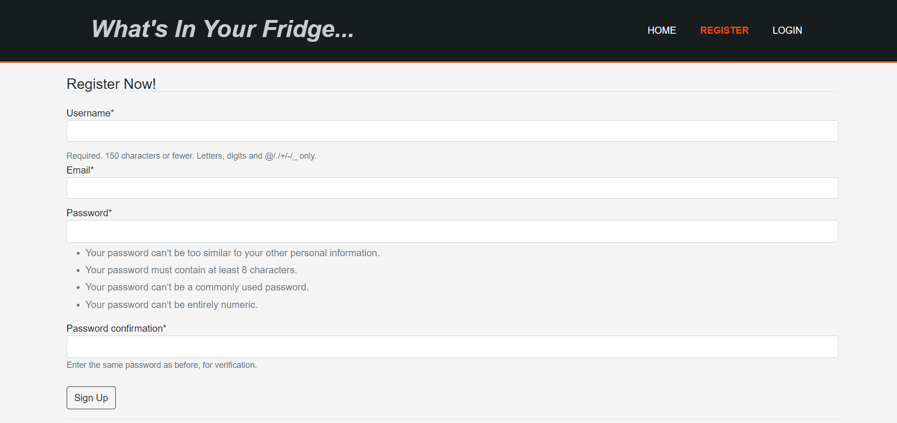
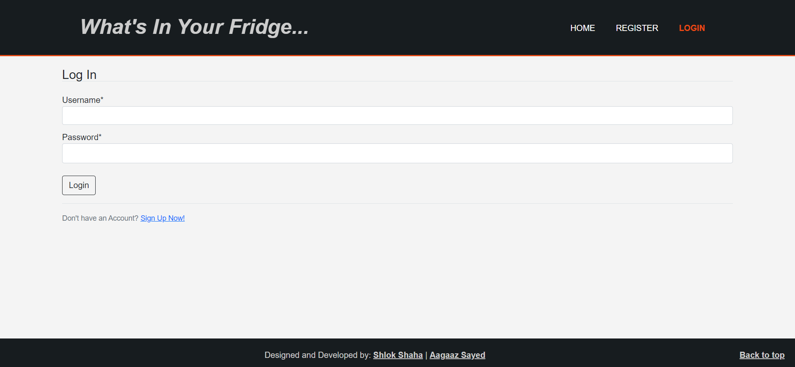
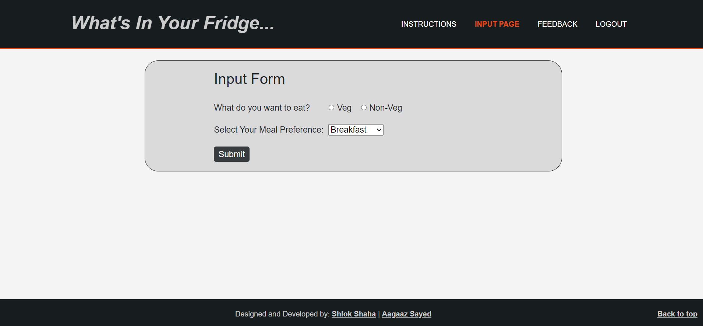

# Whats In Your Fridge...
A Django-based web application which recommends recipes to the user based on the ingredients the user has in his/her Fridge.

## Project Link 
http://whats-in-ur-fridge.herokuapp.com/

## Tech Stack Used

**Frontend:** HTML, CSS, Bootstrap

**Backend:** Django

**Machine Learning:** Pandas, Scikit-learn (for recommendation)

## How to use the website?

- If you don't have the account, Sign Up/Register.
- If you already have the account Login.
- On the input page, select your meal preference (Breakfast/Lunch/Dinner and Veg/Non-Veg) and submit the form.
- You will be redirected to ingredients page. Enter the ingredients you have and submit the form. 
- You will be redirected to the results page. 
- Based on the meal preference and the ingredients you entered you will be recommended top 10 recipes.

## Screenshots
- Home Page

- Register Page

- Login Page

- Input Page

- Veg Ingredients Input Page

- Non-Veg Ingredients Input Page

- Veg Result Page

- Non-Veg Result Page

